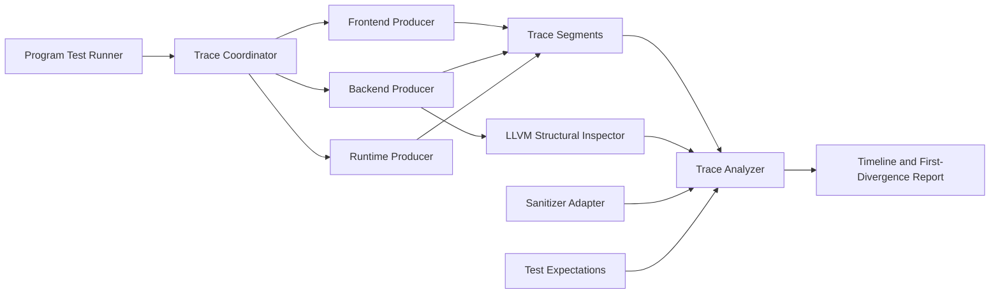

# Program Observability Architecture

Status: Accepted; Stages 1 and 2 implemented; Stage 3 core implemented

This document defines the target architecture for turning Yogi Program Tests
from end-to-end smoke tests into structured, cross-phase behavioral audits.

The design is intentionally broader than leak detection. A program can produce
the expected output while using the wrong copy/move decision, losing destructor
metadata, promoting storage unnecessarily, invalidating a pointer too early, or
lowering a type incorrectly. Program Observability must detect the first point
where actual behavior diverges from Yogi semantics.

## Design Decision

Yogi should add a versioned **Program Observability** subsystem with:

1. A test coordinator that gives every compile/run a trace session.
2. Typed event producers in the frontend, backend, and runtime.
3. Stable identities that survive phase and process boundaries.
4. A trace analyzer built from subsystem-specific state reducers.
5. Universal invariants plus test-specific surgical expectations.
6. A structural LLVM inspector that uses LLVM APIs instead of text snapshots.
7. Sanitizers as an additional source of anomalies, not the semantic oracle.

The event stream is not a prose debug log. Every record conforms to a schema,
has a sequence, carries relationships, and can be reduced into a verified state
model.

## Current-System Audit

Yogi already has useful foundations:

| Area | Existing support | Current limitation |
|---|---|---|
| Program harness | CTest invokes one CMake script per program | Scripts repeat compilation, artifact, execution, stderr, and output checks |
| Artifacts | AST, SIR, LLVM IR, object files, executable | No shared artifact manifest or cross-artifact correlation IDs |
| Frontend identity | Module-local `symbolId` and `scopeId` | IDs collide across modules; AST nodes and most values have no stable ID |
| SIR | Source positions, selected symbol/scope IDs, function effects | Ownership decisions are not uniformly represented as typed operations |
| Backend | LLVM verification and emitted `.ll` files | Program Tests mostly inspect IR with fragile regular expressions |
| Source attribution | LLVM emits module/function/source context calls | No frame ID, value ID, causality, or ordered state transition |
| Memory telemetry | Allocation volume and source/function attribution | Aggregate counters, no event history; address reuse is not a new identity |
| Ownership debug | Double-free, invalid free, double-destroy, leaks | Separate table from telemetry; no owner/borrow graph or event sequence |
| Native fixtures | Exact resource counters in several Program Tests | Each fixture invents its own protocol; no standard external-resource events |
| Sanitizers | ASan/UBSan and LSan where supported | Correctly detects machine-level faults, but cannot prove Yogi semantics |

Important architectural risks in the current implementation:

- `symbolId` and `scopeId` restart in each semantic module.
- Runtime addresses are used as record keys. Allocator address reuse destroys
  historical identity unless an explicit allocation generation exists.
- Telemetry and ownership debug can describe the same allocation differently
  because they are independent state stores.
- There is no global or phase-local event sequence.
- There is no automatic final invariant pass for every Program Test.
- Leak reporting is explicit because some runtime values are intentionally
  long-lived, but there is no declarative survivor allowlist.
- Semantic metadata is sometimes encoded inside strings such as builtin method
  metadata, which is hard to version and audit.
- Runtime telemetry is currently active outside a dedicated observability mode,
  so production-cost separation is incomplete.
- Exact IR string checks can fail after harmless naming changes and still miss a
  structurally incorrect instruction sequence.

These are not reasons to discard the existing systems. Memory telemetry,
ownership debug, source attribution, LLVM verification, and sanitizer support
should become producers or adapters for the unified model.

## Architecture



The coordinator owns the trace session. Producers never decide independently
how identities or files are named.

The analyzer has two responsibilities:

1. Reconstruct actual state through reducers.
2. Compare that state and event history against invariants and expectations.

## Activation and Production Cost

Add a dedicated build option:

```cmake
YOGI_ENABLE_PROGRAM_OBSERVABILITY=OFF
```

Expected modes:

```txt
OFF:
  production build
  no event calls emitted
  no trace fields added to runtime state
  no trace writer linked

PROGRAM_TEST:
  strict structured tracing
  trace I/O failure fails the test
  final invariants run automatically

DOCTOR:
  structured tracing for a user-selected program
  timeline and summary artifacts are retained
```

Runtime selection should use environment values supplied by the runner:

```txt
YOGI_TRACE_SESSION=<opaque session id>
YOGI_TRACE_DIRECTORY=<build-local directory>
YOGI_TRACE_CATEGORIES=ownership,borrow,memory,array,pointer,function,abi
YOGI_TRACE_STRICT=1
```

Compile-time gating provides zero production event cost. Runtime category
filters reduce event volume in observability builds.

Ownership correctness checks may remain available in debug builds independently
of full tracing, but the trace tables must not be required in production.

## Session and Artifact Layout

Each run receives one opaque session ID and a build-local directory:

```txt
build/tests/<case>/trace/
  manifest.json
  frontend.events.jsonl
  backend.events.jsonl
  runtime.events.jsonl
  sanitizer.events.jsonl
  merged.events.jsonl
  summary.json
  anomalies.json
  timeline.txt
  artifacts/
    ast-index.json
    sir-index.json
    llvm-index.json
```

JSON Lines is the first transport, not the semantic schema. Records are typed
JSON objects validated by `schemaVersion` and `eventKind`; free-form log lines
are not accepted as events. A binary transport can be introduced later without
changing the event model.

Separate producer files avoid cross-process locking. The coordinator merges
them after each phase barrier:

```txt
frontend parse/analyze complete
backend lowering/link complete
runtime process complete
sanitizer collection complete
```

The merged order uses `(phaseOrdinal, producerOrdinal, sequence)`. Wall-clock
timestamps are optional diagnostics and never define correctness.

## Event Schema

Every event has a common envelope:

```json
{
  "schemaVersion": 1,
  "sessionId": "session:...",
  "eventId": "event:runtime:184",
  "sequence": 184,
  "phase": "runtime",
  "category": "ownership",
  "eventKind": "ownership.transfer",
  "producer": "yogi-runtime",
  "entityId": "value:main.ts:42",
  "causeEventId": "event:runtime:181",
  "parentEventId": "event:runtime:170",
  "moduleId": "module:main.ts",
  "functionId": "function:main.ts:consume",
  "frameId": "frame:7",
  "nodeId": "node:main.ts:93",
  "symbolId": "symbol:main.ts:12",
  "typeId": "type:sha256:...",
  "source": {
    "path": "main.ts",
    "line": 18,
    "column": 5
  },
  "relationships": [
    {"role": "fromOwner", "id": "owner:frame:7:holder"},
    {"role": "toOwner", "id": "owner:frame:8:param:0"},
    {"role": "allocation", "id": "allocation:runtime:31"}
  ],
  "reason": "value_parameter_resource_transfer",
  "before": {
    "ownerId": "owner:frame:7:holder",
    "state": "owned"
  },
  "after": {
    "ownerId": "owner:frame:8:param:0",
    "state": "moved"
  },
  "details": {}
}
```

Required fields:

```txt
schemaVersion
sessionId
eventId
sequence
phase
category
eventKind
producer
```

Entity and relationship fields are required when the event describes an
entity. Source location is required when a source-correlated operation exists.

`reason`, `before`, `after`, and `details` use event-specific schemas. They are
not arbitrary text bags.

## Identity Model

An address, LLVM temporary name, or source variable name is metadata, not a
stable identity.

| Identity | Construction | Lifetime |
|---|---|---|
| `sessionId` | Coordinator-generated opaque ID | Entire compile and run |
| `moduleId` | Normalized project-relative path identity | Entire session |
| `nodeId` | Module ID plus deterministic AST traversal ID | AST through runtime correlation |
| `symbolId` | Module-qualified semantic symbol ID | Semantic declaration lifetime |
| `scopeId` | Module-qualified semantic scope ID | Semantic scope lifetime |
| `typeId` | Hash of normalized resolved type | Shared for structurally identical types |
| `valueId` | Semantic value identity | Persists across move; copy creates a new value ID |
| `functionId` | Qualified function symbol | Compile and runtime |
| `frameId` | Runtime monotonic call-frame ID | One invocation |
| `ownerId` | Owner region/slot/frame/global identity | Ownership interval |
| `borrowId` | Runtime/compiler borrow instance | Borrow interval |
| `pointerId` | Pointer value identity | Pointer lifetime |
| `allocationId` | Monotonic runtime allocation ID | Allocation through realloc/free |
| `descriptorId` | Aggregate descriptor identity | Descriptor lifetime |
| `bufferId` | Array/string/dictionary buffer identity | Buffer lifetime |
| `slotId` | Stable array/object slot identity plus generation | Slot lifetime |
| `viewId` | View descriptor identity | View lifetime |
| `resourceId` | Runtime/native resource identity | Resource lifetime |
| `temporaryId` | Semantic/lowered temporary identity | Full-expression or promoted lifetime |

Rules:

- A move preserves `valueId` and changes `ownerId`.
- A copy creates a new `valueId` with `copiedFrom`.
- Reallocation preserves `allocationId`, increments its generation, and may
  change its address.
- Address reuse creates a new `allocationId`.
- A pointer targets a region/slot identity, not merely an address.
- Pointer invalidation references the event that invalidated its target.
- Frontend local IDs must be module-qualified before they enter SIR.
- Imported symbols keep the defining module identity.

## Frontend Instrumentation

The frontend should emit:

### Parser and AST

```txt
module.parse.begin
ast.node.create
ast.node.parent
module.parse.end
```

AST FlatBuffers should gain a deterministic `node_id`. The ID is assigned by a
single preorder walk after parsing so it does not depend on object allocation
order.

### Symbols and Scopes

```txt
scope.enter
scope.exit
symbol.declare
symbol.resolve
symbol.export
symbol.import
```

Resolution events connect the identifier node to the defining symbol.

### Types

```txt
type.declare
type.resolve
type.alias.expand
type.narrow
type.merge
type.cast
type.layout.plan
```

Type IDs come from normalized resolved types, not raw source spelling.

### Ownership, Borrow, and Escape Decisions

```txt
ownership.plan.copy
ownership.plan.move
ownership.plan.borrow
ownership.plan.destroy
borrow.plan.create
borrow.plan.end
escape.analyze
escape.decision
storage.plan
materialization.plan
pointer.invalidation.plan
function.summary.compute
```

Every decision includes a machine-readable reason and affected identities.

Examples:

```txt
reason=resource_owning_value_assignment
reason=return_transfers_to_caller
reason=known_callee_borrow
reason=unknown_native_call_conservative_escape
reason=address_taken_requires_pointer_safe_storage
```

## SIR Correlation

SIR should become the typed contract between semantic analysis and lowering.

Add common correlation metadata:

```txt
node_id
value_id
type_id
decision_ids
```

Do not add trace-only prose to `builtin_method`. Ownership, borrow, storage, and
invalidation metadata should use typed FlatBuffer tables or enums.

Recommended side tables in the SIR module:

```txt
SemanticDecision {
  decision_id
  node_id
  value_id
  kind
  reason
  related_ids
}

ValueIdentity {
  value_id
  origin_node_id
  symbol_id
  type_id
}
```

A side table prevents every SIR node table from accumulating unrelated fields.
Nodes that need direct lookup keep only compact IDs.

The analyzer verifies:

```txt
frontend decision exists
SIR operation references that decision
lowering consumes the same decision
runtime event realizes it when runtime work is required
```

## Backend and Lowering Instrumentation

The backend should emit:

```txt
module.lower.begin
function.lower.begin
value.lower.begin
value.lower.end
ownership.lower.copy
ownership.lower.move
ownership.lower.borrow
cleanup.region.create
cleanup.schedule
cleanup.rearm
cleanup.cancel
cleanup.emit
cleanup.execute
allocation.lower
pointer.check.lower
bounds.check.lower
layout.lower
abi.marshal.lower
function.lower.end
module.verify
object.emit
link.begin
link.end
```

LLVM instructions related to semantic behavior should carry metadata:

```llvm
!yogi.node = !{!"node:main.ts:93"}
!yogi.value = !{!"value:main.ts:42"}
!yogi.type = !{!"type:sha256:..."}
!yogi.decision = !{!"decision:main.ts:17"}
```

Metadata is enabled only in observability builds and does not change generated
program semantics.

## Structural LLVM Inspection

Program Tests should stop relying on complete IR text comparisons.

The proposed C++ test runner can reuse LLVM libraries already linked by Yogi:

```txt
parse module with LLVM IRReader
find functions by qualified identity metadata
inspect FunctionType and calling convention
inspect DataLayout and StructLayout
walk instructions and CFG
query allocas, loads, stores, GEPs, PHIs, calls, branches, casts
query alignment and attributes
follow !yogi.* correlation metadata
```

Example assertions:

```json
{
  "kind": "ir.structLayout",
  "type": "type:User",
  "fieldOrder": ["id", "score"],
  "fieldOffsets": [0, 8],
  "size": 16,
  "alignment": 8
}
```

```json
{
  "kind": "ir.call",
  "function": "function:main.ts:store",
  "callee": "yogi_array_splice",
  "count": 1,
  "correlatedDecision": "decision:main.ts:splice-transfer"
}
```

Generated basic-block names and temporary SSA names are never test contracts.

## Runtime Instrumentation

The runtime producer should unify existing telemetry and ownership records
behind one identity registry and event writer.

Core event families:

### Functions and Control Flow

```txt
frame.enter
parameter.initialize
branch.take
loop.iteration
scope.enter
scope.exit
return.begin
return.transfer
frame.cleanup.begin
frame.cleanup.end
frame.exit
process.exit
```

### Values and Ownership

```txt
value.initialize
value.read
value.write
value.copy
value.move
ownership.acquire
ownership.transfer
ownership.release
destructor.call
destructor.complete
value.invalidate
```

High-volume read/write events are enabled only when requested by a test selector.
Lifetime events remain part of the strict core profile.

### Memory

```txt
allocation.create
allocation.reallocate
allocation.free
storage.promote
buffer.create
buffer.replace
buffer.free
descriptor.create
descriptor.destroy
temporary.create
temporary.destroy
```

### Borrows and Pointers

```txt
borrow.create
borrow.use
borrow.end
pointer.create
pointer.project
pointer.read
pointer.write
pointer.invalidate
pointer.invalidUse
```

### Arrays

```txt
array.create
array.policy.install
array.slot.create
array.slot.overwrite
array.slot.move
array.slot.remove
array.capacity.change
array.storage.change
array.view.create
array.view.materialize
array.bounds.check
array.destroy
```

Array payloads include:

```txt
descriptorId
bufferId
length/capacity before and after
storageMode
elementTypeId
rank/shape/strides/baseOffset when applicable
element ownership policy identity
affected slot IDs and generations
```

### ABI and External Resources

```txt
abi.call.begin
abi.argument.marshal
abi.temporary.create
abi.native.enter
abi.native.exit
abi.return.unmarshal
abi.copyBack
abi.temporary.destroy
resource.create
resource.transfer
resource.destroy
abi.call.end
```

Native test fixtures receive a small test-only C ABI for registering resource
events. Existing exact counters remain useful as an independent oracle.

## Trace Writer Safety

Instrumentation must not corrupt the behavior it observes.

Requirements:

- The writer never allocates through `yogi_alloc`.
- It uses a dedicated untracked arena or direct system allocation.
- A recursion guard rejects event emission caused by the writer itself.
- Producer buffers have explicit flush barriers at phase/frame/process end.
- Dropped events are a fatal anomaly in strict Program Test mode.
- A crash leaves complete records up to the last committed event.
- Trace I/O never changes ownership or cleanup decisions.
- Thread IDs and atomic sequence blocks are included before concurrency ships.

## State Reducers

The analyzer does not apply one giant universal state machine. It composes
reducers selected by observed event categories.

| Reducer | Reconstructed state |
|---|---|
| Module reducer | phase progress, artifacts, module dependencies |
| Symbol/type reducer | declarations, resolutions, narrowing, layouts |
| Function reducer | frames, parameters, returns, cleanup state |
| Ownership reducer | owner graph, move/copy history, destructor responsibility |
| Borrow reducer | active borrows, mutability, owner dependencies |
| Memory reducer | allocations, generations, reallocations, frees |
| Aggregate reducer | descriptor lifetime and nested ownership |
| Array reducer | buffers, slots, views, storage mode, capacity, element owners |
| Pointer reducer | targets, projections, generations, validity |
| Union reducer | active tag, payload, prior-payload cleanup |
| ABI reducer | marshalled values, temporaries, native resources, copy-back |
| Control-flow reducer | scopes, paths, early exits, cleanup obligations |

Reducers emit anomalies immediately when a transition is invalid. Later
expectations cannot hide an earlier invariant failure.

## Universal Invariants

Every strict Program Test runs these automatically:

```txt
trace schema is valid
event sequences are monotonic per producer
all referenced identities exist or are declared external
all phase barriers complete
frontend/SIR/backend correlations are complete for traced decisions
every entered frame exits or terminates through a recorded fatal event
every ownership transfer has exactly one previous and one next owner
no value is read after move/invalidation/destruction
no owner is destroyed while a borrow depends on it
every borrow ends
every allocation is freed or explicitly allowed to survive
every descriptor and buffer is destroyed or explicitly allowed to survive
every native resource is destroyed exactly once or explicitly transferred out
no double free, invalid free, or double destructor occurs
no cleanup obligation executes twice
no required cleanup obligation remains pending
no trace event was dropped
sanitizer layer reports no unexpected anomaly
exit code/stdout/stderr match the test contract
```

Intentional survivors use an explicit manifest allowlist:

```json
{
  "allowLive": [
    {
      "category": "runtime.cache",
      "type": "interned-string-table",
      "reason": "process-lifetime cache"
    }
  ]
}
```

An allowlist entry must include a semantic category and reason. Raw addresses or
unbounded wildcard allowances are forbidden.

## Subsystem Invariants

Reducers add invariants only when relevant entities appear.

Examples:

### Arrays

```txt
length <= capacity
slot IDs are unique within a descriptor generation
removed slots invalidate dependent pointers
preserved slots keep identity across allowed operations
resource-owning elements have exactly one owner
descriptor policy matches every inserted resource-owning element
views reference a live owner or a recorded materialization
row-major offsets match shape and strides
```

### Functions

```txt
summary effects agree with observed runtime effects
borrow parameters do not transfer ownership
consuming value parameters do transfer ownership
return ownership reaches the caller before callee cleanup
callee never destroys borrowed arguments
```

### Structs

```txt
semantic field order matches LLVM StructLayout
field replacement destroys the previous resource before acquiring the new one
field pointer offset matches the declared field
aggregate destruction follows field cleanup policy exactly once
```

### Unions

```txt
tag matches active payload
old payload is destroyed before incompatible tag replacement
payload is never read under the wrong tag
```

## Surgical Expectations

Each test uses a versioned JSON manifest:

```txt
tests/programs/cases/<case-name>/program.test.json
```

Example:

```json
{
  "schemaVersion": 1,
  "name": "resource-array-pointer-policy",
  "entry": "program/main.ts",
  "trace": {
    "profile": "strict",
    "categories": [
      "ownership",
      "memory",
      "array",
      "pointer",
      "function",
      "abi"
    ]
  },
  "run": {
    "exitCode": 0,
    "stdoutFile": "expected.stdout",
    "stderr": "empty"
  },
  "invariants": [
    "universal",
    "array.structural",
    "ownership.resource",
    "function.cleanup"
  ],
  "expectations": [
    {
      "kind": "count",
      "eventKind": "ownership.transfer",
      "where": {
        "reason": "splice_removed_element_transfer"
      },
      "equals": 2
    },
    {
      "kind": "sequence",
      "entity": {
        "bind": "ticket",
        "type": "JobTicket"
      },
      "events": [
        "resource.create",
        "array.slot.create",
        "ownership.transfer",
        "destructor.call",
        "resource.destroy"
      ],
      "allowInterleaving": true
    },
    {
      "kind": "absent",
      "eventKind": "array.view.materialize",
      "where": {
        "nodeId": "node:main.ts:return-borrow"
      }
    },
    {
      "kind": "max",
      "eventKind": "allocation.reallocate",
      "where": {
        "entity": "$tickets.buffer"
      },
      "value": 4
    }
  ],
  "ir": [
    {
      "kind": "call",
      "function": "main.ts:takeRange",
      "callee": "yogi_array_splice",
      "count": 1
    }
  ]
}
```

Supported expectation operators:

```txt
exists
absent
count/min/max
before
immediatelyBefore
sequence/subsequence
sameEntity
relatedTo
stateBefore/stateAfter
transition
finalState
ir.call
ir.instruction
ir.cfg
ir.functionSignature
ir.structLayout
ir.dataLayout
```

Selectors prefer source-level IDs, types, reasons, relationships, and bound
entities. Generated addresses, SSA names, and unrelated event positions are not
stable selectors.

## Avoiding Fragile Tests

Rules:

1. Assert semantic relationships, not complete traces.
2. Use subsequences when unrelated events may interleave.
3. Bind an entity once and follow its identity.
4. Assert exact counts only when the count is part of language semantics.
5. Use upper bounds for optimization expectations such as allocations.
6. Inspect LLVM structurally and ignore temporary names/block labels.
7. Keep source IDs deterministic and module-qualified.
8. Version event and manifest schemas.
9. Normalize paths and remove host-specific addresses from golden reports.
10. Store a full trace only as a failure artifact, not as the expected result.

## First-Divergence Reports

When a reducer or expectation fails, report:

```txt
test and session
first failing event
source span
expected transition
actual transition
entity identity and type
before/after state
causal parent
owner/borrow/pointer dependencies
linked frontend decision
linked SIR operation
linked LLVM instruction
nearest runtime events
sanitizer evidence when present
```

Example:

```txt
ownership invariant failed at event runtime:184
source: main.ts:18:5
value: value:main.ts:42 (Holder)

expected:
  transfer owner frame:7:holder -> frame:8:param:0

actual:
  frame:7:holder remained active
  frame:8:param:0 also acquired destructor responsibility

first divergence:
  backend event backend:91 lowered a copy although
  frontend decision decision:main.ts:17 required a move

consequence:
  two live owners reference allocation runtime:31
```

The report starts at the first divergence, not the final double-free symptom.

## Sanitizer Integration

Keep the existing separate sanitizer build:

```txt
ASan: invalid access, UAF, heap corruption
UBSan: undefined machine behavior
LSan: leaks where the platform supports it
```

The runner converts sanitizer output and exit status into structured
`sanitizer.anomaly` events linked to the runtime phase.

Sanitizer capability is written to `manifest.json`:

```json
{
  "sanitizers": {
    "address": true,
    "undefined": true,
    "leak": false,
    "leakUnavailableReason": "Apple runtime does not provide LSan"
  }
}
```

A missing platform capability is visible, not silently interpreted as a pass.
Yogi ownership/resource invariants still run on every platform.

## Proposed Test Layout

New tests should use:

```txt
tests/programs/
  runner/
    programTestRunner.cpp
    manifest.cpp
    process.cpp
    trace/
      event.cpp
      reader.cpp
      merger.cpp
      analyzer.cpp
      report.cpp
      reducers/
      invariants/
    llvm/
      inspector.cpp
    sanitizer/
      adapter.cpp

  cases/
    native-resource-array-pointer-policy/
      program.test.json
      expected.stdout
      program/
        main.ts
        models.ts
        array_ops.ts
      native/
        native_jobs.c
```

CTest registers the same runner for every manifest:

```txt
yogi_program_test_runner --manifest <program.test.json>
```

Legacy `.cmake` Program Tests remain available during migration. The runner can
initially execute a legacy script and add universal artifact/runtime checks,
then each case can move to the manifest layout independently.

## Implementation Plan

### Stage 0: Contract and Inventory

Status: this document.

```txt
define event envelope
define identity semantics
define trace/session directory
inventory existing Program Tests and current observability hooks
```

### Stage 1: Shared Runner and Runtime Lifetime Core

Build the smallest useful vertical slice:

```txt
add YOGI_ENABLE_PROGRAM_OBSERVABILITY
add trace coordinator and manifest
add typed runtime writer
unify allocation/aggregate IDs across telemetry and ownership debug
emit allocation, realloc, free, descriptor create/destroy, frame enter/exit
run universal memory/aggregate invariants automatically
add sanitizer adapter
migrate native-resource-array-pointer-policy first
```

This stage should immediately detect leaks, address-reuse confusion, incomplete
frames, double cleanup, and missing final destruction without native stdout
counters being the only oracle.

### Stage 2: Stable Frontend and SIR Identity

```txt
assign deterministic AST node IDs
qualify symbol/scope IDs by module
assign normalized type IDs and semantic value IDs
serialize correlation side tables in AST/SIR
emit symbol, type, ownership, borrow, escape, and storage decisions
```

Generated FlatBuffer files must be regenerated through the existing schema
workflow; generated files are not edited manually.

Implemented. The frontend assigns deterministic module/node/value/type/decision
IDs and serializes value/decision side tables into SIR. The backend consumes
those exact IDs, records `sir.decision.read` and
`lowering.decision.consume`, attaches `!yogi.node`, `!yogi.value`,
`!yogi.type`, and `!yogi.decision` metadata, and emits
`semantic.decision.execute` at runtime when a lowered operation executes.

### Stage 3: Backend Correlation and Structural LLVM Inspector

```txt
consume typed SIR decision IDs
emit lowering and cleanup events
attach !yogi.* LLVM metadata
implement LLVM API-based assertions
replace regex checks in migrated tests
```

The Stage 3 core is implemented. Cleanup obligations now receive stable IDs
and emit `cleanup.schedule`, `cleanup.rearm`, `cleanup.cancel`,
`cleanup.emit`, and `cleanup.execute`. Generated observer calls carry
`!yogi.cleanup`, `!yogi.owner`, and `!yogi.destroy`, while
`!yogi.cleanup.obligations` indexes the module's cleanup plans.

The Program Trace Analyzer recursively discovers emitted `.ll` artifacts,
parses each one through LLVM `IRReader`, and runs `verifyModule`. Surgical
manifests can assert functions, direct calls, call-site metadata, and named
metadata structurally. Migration away from old regex assertions is incremental;
`native_job_ticket_ownership` is the first fully migrated program.

### Stage 4: Ownership, Borrow, Function, and Control-Flow Reducers

```txt
owner reducer
bounded borrow reducer
LIFO function/frame reducer
dynamic cleanup generations
normal/return/break/continue cleanup correlation
lost, duplicate, and wrong-path obligation detection
```

Implemented. Runtime semantic and cleanup events carry their active `frameId`.
Frame exits distinguish normal completion from explicit return. Cleanup
execution sites carry `normal`, `return`, `break`, or `continue`, and the
analyzer checks each runtime path against the sites emitted by lowering.

The runtime cleanup reducer tracks each lexical `cleanupId` as a separate
generation per function invocation. Replacement `rearm` closes the previous
generation and opens the next one; `cleanup.skip` discharges a null slot without
calling a destructor. The reducer rejects lost obligations, duplicate terminal
transitions, and execution in the wrong frame or exit path.

Stage 4 is the final large structural observability stage. The infrastructure is
stable and sufficient for current Program Tests.

### Feature-Coupled Follow-up

Future observability changes are incremental parts of real language features,
not additional standalone stages. Remaining limitations are:

```txt
borrow observations are bounded to current expression/call semantics
legacy survivor allowances remain until their language cleanup is implemented
historical LLVM regex assertions migrate only when their tests are touched
future runtime entities need focused identities when their features land
```

## Stage Gates

No stage is complete until:

```txt
event schema has negative validation tests
trace writer failures are tested
identity reuse is tested
analyzer catches intentionally injected bad traces
normal Program Tests still pass
observability Program Tests pass under sanitizers
production build contains no trace calls
documentation and migration status are updated
```

## Non-Goals

This architecture does not introduce:

- Garbage collection.
- Global pointer scanning.
- A Rust-style user-facing borrow checker.
- Full IR text snapshots.
- Mandatory tracing in production.
- A requirement that every Program Test enable every high-volume event.
- New user-facing language syntax.

The purpose is to verify Yogi's existing and future semantics with evidence
that spans every compilation and runtime phase.

## Recommended First Implementation Lot

Implement **Stage 1: Shared Runner and Runtime Lifetime Core**.

It is the best first lot because Yogi already has allocation telemetry,
ownership debug, source attribution, CTest integration, and sanitizer builds.
Unifying those pieces behind stable allocation/descriptor IDs and automatic
final invariants produces immediate value without first instrumenting every
frontend node or LLVM instruction.

The first migrated case should be:

```txt
native-resource-array-pointer-policy
```

It already combines modules, native resources, arrays, pointers, structural
mutation, returns, nested aggregates, control flow, LLVM artifacts, exact
resource counters, and sanitizers. It is a strong vertical acceptance test for
the new architecture.

## Stage 1 Implementation Status

Stage 1 is implemented with:

```txt
tests/programs/runner/runProgramTest.cmake
tests/programs/runner/programTraceAnalyzer.cpp
src/runtime/src/observability/programObservability.cpp
```

Every registered Program Test now runs through the shared coordinator. Legacy
scripts still build their fixtures and assert their functional behavior, while
the coordinator adds the normalized manifest, session, runtime event segments,
analyzer, anomaly report, summary, and timeline.

The runtime currently emits:

```txt
function.frame.enter / function.frame.exit
memory.allocate / memory.reallocate / memory.free
aggregate.create / aggregate.destroy
resource.create / resource.destroy
process.summary
anomaly.resource_lifetime
```

Allocation identity is independent from the allocator address. Reallocation
preserves the identity and increments its generation. Reusing an address after
free creates a new identity; the analyzer has a negative test that rejects
identity resurrection.

The first surgical manifest is:

```txt
tests/programs/manifests/native_resource_array_pointer_policy.json
```

It validates exactly 33 native resource creations and 33 destructions in
addition to the universal Stage 1 invariants.

### Transitional Survivor Contracts

Stage 1 exposed pre-existing cleanup debt that stdout, native counters, and
sanitizers did not identify:

```txt
AnyValue wrappers
boxed struct/object values and property storage
selected temporary array descriptors and buffers
retained/materialized array views
projected pointer cells
```

These survivors are named individually by category and type in generated
legacy manifests. There is no wildcard allowance. A survivor with any other
category/type fails the Program Test.

This is intentionally visible debt, not a claim that the memory model is
complete. Future lifetime lots must remove these allowances as the corresponding
cleanup becomes real.

## Stage 2 Implementation Status

Stage 2 adds a stable semantic chain:

```txt
semantic.decision.plan
  -> sir.decision.read
  -> lowering.decision.consume
  -> semantic.decision.execute
```

The analyzer joins these events by `decisionId`. It rejects a missing SIR or
lowering stage, duplicate compile-stage consumption, and changes to the
decision kind or reason. Runtime execution is path-dependent, so the universal
rule permits zero executions for dead code; a surgical manifest can require a
minimum runtime count for decisions that its program must execute.

Current typed decisions include:

```txt
Copy: trivial value copy, explicit/copy-producing array operations
Move: resource initialization, assignment, return, value parameter
Borrow: address-of, derived views, known-callee aggregate borrow
Escape: declaration or conservative external-call escape
Storage: stack, heap, and global storage
Materialize: borrowed view copied into owned storage
Promote: owner/lifetime promotion required by an escaping value
```

The identity contract is:

```txt
moduleId   = normalized project-relative module path
nodeId     = deterministic preorder position in that module
symbolId   = module-qualified semantic symbol identity
scopeId    = module-qualified semantic scope identity
typeId     = SHA-256 of the normalized resolved type
valueId    = deterministic semantic value ordinal
decisionId = deterministic semantic decision ordinal
```

The identities are observability metadata. They do not affect ownership
semantics or generated program output. Runtime observation calls and their
LLVM metadata are compiled only when
`YOGI_ENABLE_PROGRAM_OBSERVABILITY=ON`.

Stage 2 deliberately did not claim that every possible semantic action was
instrumented. Stage 3 now covers cleanup identities and structural LLVM
inspection. Complete owner/borrow graphs, control-flow reducers, and
descriptor/slot identities remain later stages.

## Stage 3 Implementation Status

A cleanup obligation now has a lifetime independent from the resource address:

```txt
cleanup.schedule
  -> cleanup.emit
  -> cleanup.execute
```

Automatic transfer can suppress local destruction:

```txt
cleanup.schedule
  -> cleanup.cancel
```

Assignment can install a new resource into an existing owner:

```txt
cleanup.schedule
  -> cleanup.rearm
  -> cleanup.emit
  -> cleanup.execute
```

One lexical cleanup may have several emitted LLVM sites because `return`,
`break`, `continue`, and normal scope exit are different control-flow paths.
It retains one `cleanupId` across those sites. Runtime execution can also occur
more than once when the containing function is invoked repeatedly.

Universal strict-mode checks reject:

```txt
cleanup event without a schedule
cleanup policy changing across phases
scheduled cleanup with neither emission nor cancellation
runtime cleanup execution without a lowered emission site
LLVM parse or verification failure
```

Manifest cleanup expectations can select owner, cleanup kind, and destroy
function. LLVM expectations can select:

```txt
function existence
direct call count
required call-site metadata
named metadata operand count
```

The inspector uses LLVM APIs and therefore ignores SSA temporary names,
formatting, whitespace, and harmless textual rearrangement.
